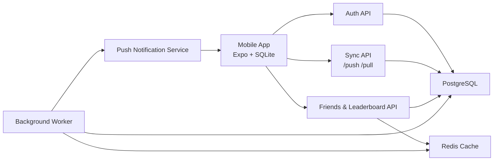

# 移动端生活工具客户端与服务端设计文档

## 概述

本文档定义一个以手机端为主的生活管理工具：支持专注计时、习惯提醒、重要事件记录、每日饮食记录与计算、记账，并通过服务器同步数据、查看好友汇总数据和进行轻量对比。

第一版建议聚焦“手机 App + 登录注册 + 本地记录 + 服务器同步 + 好友排行榜”。饮食、记账、重要事件纳入总体数据模型，但可以作为第二阶段完整实现，避免 MVP 同时承载过多复杂度。

## 产品定位

目标不是做一个公开社交平台，而是做一个带有好友陪伴感的个人生活自管理工具。

核心原则：

- 手机端优先：主要使用场景是每天在手机上快速记录和查看。
- 本地可用：断网时也能计时、打卡、记录，联网后同步。
- 隐私优先：默认私密，好友侧优先展示汇总数据，不暴露敏感原始记录。
- 轻社交：好友功能用于陪伴、排行和挑战，不做复杂动态流。
- 数据统一：所有生活数据都拥有用户归属、时间、分类、标签、隐私、同步状态。

## 推荐技术栈

### 客户端

- 框架：React Native + Expo + TypeScript
- 路由：expo-router
- 本地数据库：expo-sqlite
- 状态管理：Zustand
- 服务端数据缓存：TanStack Query
- 表单与校验：React Hook Form + Zod
- 通知：expo-notifications
- 图表：victory-native 或 react-native-svg-charts

### 服务端

- 框架：NestJS + TypeScript
- 数据库：PostgreSQL
- ORM：Prisma
- 缓存与任务：Redis
- 认证：JWT access token + refresh token
- API 文档：OpenAPI
- 部署：Docker + Caddy/Nginx + 云服务器

### 仓库结构

建议使用 monorepo，便于客户端、服务端和共享类型并行开发。

```txt
life-tool/
  apps/
    mobile/              # Expo React Native App
    api/                 # NestJS API 服务
  packages/
    shared/              # DTO、枚举、Zod schema、共享类型
    database/            # Prisma schema、迁移、seed
  docs/
    api.md
    sync.md
    privacy.md
```

## 系统架构



## MVP 范围

第一阶段必须完成：

1. 注册、登录、刷新 token、退出登录。
2. 手机端底部导航与基础页面。
3. 本地 SQLite 数据库。
4. 专注计时记录：创建、完成、同步、统计。
5. 习惯：创建习惯、每日打卡、提醒、同步、统计。
6. 好友：好友申请、通过、删除。
7. 好友排行榜：今日/本周专注时长、习惯完成率、连续打卡天数。
8. 隐私设置：仅自己可见、好友仅看汇总、好友可看详情。

第二阶段扩展：

1. 饮食记录与热量、营养计算。
2. 记账记录与月度预算。
3. 重要事件记录。
4. 好友挑战。
5. 多设备冲突处理增强。
6. 数据导出与备份。

## 客户端设计

### 客户端职责

客户端负责：

- 提供主要移动端交互体验。
- 在本地 SQLite 保存用户数据。
- 支持断网记录和稍后同步。
- 管理本地提醒。
- 展示服务端返回的好友汇总和排行榜。
- 尊重用户隐私设置，不主动上传未授权展示的派生数据。

客户端不负责：

- 判定好友是否有权限查看某项数据。
- 计算跨用户排行榜最终结果。
- 信任本地时间作为服务端权威时间。
- 暴露其他用户原始数据。

### 底部导航

```txt
Today       今日总览
Focus       专注计时
Records     饮食、记账、事件记录
Friends     好友、排行榜、挑战
Profile     账号、隐私、同步状态
```

### 页面划分

#### Today 页面

展示今日关键数据：

- 今日专注分钟数。
- 今日习惯完成情况。
- 今日饮食总热量与宏量营养。
- 今日支出。
- 今日重要事件。
- 同步状态。

MVP 阶段 Today 只需要展示专注和习惯。

#### Focus 页面

功能：

- 番茄钟。
- 自定义倒计时。
- 正计时。
- 选择任务分类。
- 结束后生成 focus_session。
- 今日和本周专注统计。

#### Records 页面

第二阶段重点页面。

记录类型：

- Meal：饮食记录。
- Ledger：记账记录。
- Event：重要事件。

MVP 阶段可以保留入口，但只做空状态或轻量事件记录。

#### Friends 页面

功能：

- 搜索用户。
- 发送好友申请。
- 处理好友申请。
- 好友列表。
- 排行榜。
- 好友挑战入口。

MVP 排行榜：

- 今日专注时长。
- 本周专注时长。
- 今日习惯完成率。
- 当前最长连续打卡。

#### Profile 页面

功能：

- 个人资料。
- 隐私设置。
- 通知设置。
- 同步状态。
- 退出登录。

### 客户端目录建议

```txt
apps/mobile/src/
  app/                    # expo-router 页面
  components/             # 通用 UI 组件
  db/                     # SQLite 初始化、DAO、迁移
  features/
    auth/
    focus/
    habits/
    records/
    friends/
    profile/
    sync/
    notifications/
  services/
    apiClient.ts
    tokenStore.ts
  store/
  theme/
  utils/
```

### 客户端本地数据

本地 SQLite 表应该与服务端核心实体保持接近，但增加客户端同步字段。

公共字段：

```txt
id                 UUID，客户端生成
user_id            当前用户 ID
created_at         本地创建时间
updated_at         本地更新时间
deleted_at         软删除时间，可为空
sync_status        pending | synced | conflict | failed
server_version     服务端版本号，可为空
last_synced_at     最近同步时间，可为空
```

本地额外表：

```txt
sync_mutations
  id
  entity_type
  entity_id
  operation        create | update | delete
  payload_json
  client_seq
  status           pending | sent | applied | failed
  error_message
  created_at

sync_state
  key
  value
```

### 客户端同步策略

推荐使用“本地先写 + 变更队列 + 后台同步”。

写入流程：

1. 用户在 App 内创建或修改记录。
2. 先写入 SQLite。
3. 同时写入 sync_mutations。
4. UI 立即更新。
5. 网络可用时调用 `POST /sync/push`。
6. 服务端返回确认、拒绝或冲突。
7. 客户端再调用 `POST /sync/pull` 拉取最新变更。

同步触发时机：

- App 启动。
- 登录成功。
- App 回到前台。
- 用户手动点击同步。
- 关键记录保存后短延迟触发。

## 服务端设计

### 服务端职责

服务端负责：

- 用户身份认证。
- 数据权威存储。
- 多设备同步。
- 好友关系管理。
- 隐私权限判断。
- 排行榜和跨用户统计。
- 推送通知。
- 审计、限流和安全防护。

服务端不应该：

- 把敏感原始记录直接返回给好友。
- 信任客户端提交的 user_id。
- 使用客户端本地时间作为唯一排序依据。
- 在没有隐私判断的情况下复用通用查询。

### 服务端模块划分

```txt
apps/api/src/
  modules/
    auth/
    users/
    devices/
    sync/
    focus/
    habits/
    records/
    friends/
    privacy/
    leaderboards/
    notifications/
  common/
    guards/
    decorators/
    filters/
    pipes/
  jobs/
  main.ts
```

### 认证设计

MVP 使用邮箱登录即可。

接口：

```txt
POST /auth/register
POST /auth/login
POST /auth/refresh
POST /auth/logout
GET  /me
```

安全要求：

- 密码使用 bcrypt 或 argon2 哈希。
- access token 短期有效。
- refresh token 存服务端并支持吊销。
- 移动端 refresh token 存安全存储，不放普通 AsyncStorage。
- 所有业务接口必须通过认证 guard。

### 好友与隐私设计

好友关系状态：

```txt
pending
accepted
blocked
deleted
```

数据可见性：

```txt
private          仅自己可见
friends_summary  好友仅可见汇总
friends_detail   好友可见详情
```

默认建议：

| 数据类型 | 默认可见性 | 好友侧展示 |
| --- | --- | --- |
| 专注记录 | friends_summary | 分钟数、排名、趋势 |
| 习惯打卡 | friends_summary | 完成率、连续天数 |
| 饮食记录 | private | 默认不展示，可选目标完成度 |
| 记账记录 | private | 默认不展示，可选预算控制率 |
| 重要事件 | private | 默认不展示 |

权限原则：

- 好友只能通过 social/leaderboards 等接口获取汇总。
- 原始记录详情接口只返回当前用户自己的数据。
- 即使记录设置为 friends_detail，也必须由服务端再次判断好友关系。

## 数据库设计

### users

```txt
id
email
password_hash
display_name
avatar_url
timezone
created_at
updated_at
deleted_at
```

### devices

```txt
id
user_id
platform           ios | android
push_token
app_version
last_seen_at
created_at
updated_at
```

### friendships

```txt
id
requester_id
addressee_id
status             pending | accepted | blocked | deleted
created_at
accepted_at
updated_at
```

约束：

```txt
unique(requester_id, addressee_id)
```

查询时需要同时处理 requester/addressee 双向关系。

### privacy_settings

```txt
id
user_id
data_type          focus | habit | meal | ledger | event
visibility         private | friends_summary | friends_detail
created_at
updated_at
```

### focus_sessions

```txt
id
user_id
title
category
started_at
ended_at
duration_seconds
mode               pomodoro | countdown | stopwatch
visibility
source_device_id
server_version
created_at
updated_at
deleted_at
```

### habits

```txt
id
user_id
name
icon
color
schedule_rule      JSON，描述每日/每周规则
target_count
reminder_rule      JSON，可为空
visibility
server_version
created_at
updated_at
deleted_at
```

### habit_checkins

```txt
id
habit_id
user_id
local_date
value              数值型打卡，例如 1 次、2 杯水
note
server_version
created_at
updated_at
deleted_at
```

约束：

```txt
unique(user_id, habit_id, local_date)
```

### event_logs

```txt
id
user_id
occurred_at
title
body
tags               JSON
visibility
server_version
created_at
updated_at
deleted_at
```

### meal_logs

```txt
id
user_id
meal_date
meal_type          breakfast | lunch | dinner | snack
total_calories
total_protein_g
total_carbs_g
total_fat_g
visibility
server_version
created_at
updated_at
deleted_at
```

### meal_items

```txt
id
meal_log_id
user_id
name
amount
unit
calories
protein_g
carbs_g
fat_g
server_version
created_at
updated_at
deleted_at
```

### ledger_transactions

```txt
id
user_id
type               income | expense
amount_cents
currency
category
merchant
note
happened_at
visibility
server_version
created_at
updated_at
deleted_at
```

### daily_stats

用于加速 Today 页和排行榜。

```txt
id
user_id
local_date
focus_seconds
habit_total_count
habit_completed_count
habit_completion_rate
meal_calories
expense_cents
created_at
updated_at
```

约束：

```txt
unique(user_id, local_date)
```

## 同步协议

### 公共实体字段

所有可同步实体都应该包含：

```txt
id
user_id
server_version
created_at
updated_at
deleted_at
```

`id` 由客户端生成 UUID，服务端接收后保留。这样断网创建的记录可以在同步后保持同一个 ID。

### POST /sync/push

请求：

```json
{
  "deviceId": "device_uuid",
  "clientSeq": 123,
  "mutations": [
    {
      "mutationId": "uuid",
      "entityType": "focus_session",
      "entityId": "uuid",
      "operation": "create",
      "baseVersion": null,
      "payload": {}
    }
  ]
}
```

响应：

```json
{
  "applied": [
    {
      "mutationId": "uuid",
      "entityType": "focus_session",
      "entityId": "uuid",
      "serverVersion": 1
    }
  ],
  "rejected": [],
  "conflicts": [],
  "serverCursor": "opaque_cursor"
}
```

### POST /sync/pull

请求：

```json
{
  "deviceId": "device_uuid",
  "cursor": "opaque_cursor_or_null",
  "entityTypes": [
    "focus_session",
    "habit",
    "habit_checkin",
    "privacy_setting"
  ]
}
```

响应：

```json
{
  "changes": [
    {
      "entityType": "habit",
      "entityId": "uuid",
      "serverVersion": 3,
      "deleted": false,
      "payload": {}
    }
  ],
  "nextCursor": "opaque_cursor",
  "hasMore": false
}
```

### 冲突规则

MVP 可使用简单规则：

- 专注记录：append-only，通常不冲突。
- 习惯定义：同一字段最后写入者生效。
- 习惯打卡：同一 `user_id + habit_id + local_date` 保留较新的 server_version。
- 饮食、记账、事件：同一记录最后写入者生效。
- 删除优先级高于旧版本更新。

服务端返回 conflict 时，客户端先显示“同步冲突”状态，MVP 可采用服务端版本覆盖本地版本。

## API 设计

### Auth

```txt
POST /auth/register
POST /auth/login
POST /auth/refresh
POST /auth/logout
```

### User

```txt
GET   /me
PATCH /me
POST  /devices
PATCH /devices/:id
```

### Sync

```txt
POST /sync/push
POST /sync/pull
```

### Friends

```txt
GET    /friends
POST   /friends/requests
GET    /friends/requests
PATCH  /friends/requests/:id
DELETE /friends/:friendUserId
```

### Privacy

```txt
GET   /privacy-settings
PATCH /privacy-settings/:dataType
```

### Leaderboards

```txt
GET /leaderboards/focus?period=today
GET /leaderboards/focus?period=week
GET /leaderboards/habits?period=today
GET /leaderboards/streaks
```

排行榜响应只返回汇总：

```json
{
  "period": "week",
  "metric": "focus_seconds",
  "entries": [
    {
      "userId": "uuid",
      "displayName": "Alex",
      "avatarUrl": null,
      "value": 7200,
      "rank": 1
    }
  ]
}
```

## 多 agent 开发分工

### Agent 1：项目骨架与共享契约

负责范围：

```txt
package.json
pnpm-workspace.yaml
apps/mobile/
apps/api/
packages/shared/
packages/database/
```

任务：

- 初始化 monorepo。
- 建立 TypeScript 配置。
- 建立共享 enum、DTO、Zod schema。
- 定义 API 基础响应格式。
- 定义实体 ID、时间、分页、错误码规范。

产出：

- 可运行的 mobile 和 api 空项目。
- `packages/shared` 可被客户端和服务端引用。

### Agent 2：客户端基础架构

负责范围：

```txt
apps/mobile/src/app/
apps/mobile/src/components/
apps/mobile/src/services/
apps/mobile/src/store/
apps/mobile/src/theme/
```

任务：

- 建立 expo-router。
- 实现底部导航。
- 实现登录态管理。
- 实现 API client。
- 实现基础 UI 组件。
- 实现 Today、Focus、Records、Friends、Profile 页面框架。

### Agent 3：客户端本地数据库与同步

负责范围：

```txt
apps/mobile/src/db/
apps/mobile/src/features/sync/
```

任务：

- 初始化 SQLite。
- 建立本地表迁移。
- 实现 DAO。
- 实现 sync_mutations 队列。
- 实现 push/pull 同步流程。
- 实现同步状态展示所需 hooks。

### Agent 4：客户端专注与习惯功能

负责范围：

```txt
apps/mobile/src/features/focus/
apps/mobile/src/features/habits/
apps/mobile/src/features/notifications/
```

任务：

- 实现专注计时器。
- 实现 focus_session 创建与完成。
- 实现习惯列表、创建、编辑、打卡。
- 实现本地提醒。
- 接入本地数据库和同步队列。

### Agent 5：服务端认证与用户模块

负责范围：

```txt
apps/api/src/modules/auth/
apps/api/src/modules/users/
apps/api/src/modules/devices/
apps/api/src/common/guards/
```

任务：

- 实现注册、登录、刷新、退出。
- 实现 JWT guard。
- 实现当前用户接口。
- 实现设备与 push token 注册。
- 写基础单元测试。

### Agent 6：服务端同步与核心数据模块

负责范围：

```txt
apps/api/src/modules/sync/
apps/api/src/modules/focus/
apps/api/src/modules/habits/
packages/database/
```

任务：

- 编写 Prisma schema。
- 实现 focus、habit、habit_checkin 持久化。
- 实现 `/sync/push`。
- 实现 `/sync/pull`。
- 实现 server_version 与软删除。
- 实现基础冲突处理。

### Agent 7：服务端好友、隐私与排行榜

负责范围：

```txt
apps/api/src/modules/friends/
apps/api/src/modules/privacy/
apps/api/src/modules/leaderboards/
```

任务：

- 实现好友申请、通过、删除。
- 实现隐私设置。
- 实现排行榜接口。
- 确保好友侧只返回汇总数据。
- 写权限测试。

### Agent 8：第二阶段记录模块

负责范围：

```txt
apps/mobile/src/features/records/
apps/api/src/modules/records/
```

任务：

- 实现饮食记录。
- 实现记账记录。
- 实现重要事件记录。
- 接入同步协议。
- 接入 Today 汇总。

该 Agent 可在 MVP 主流程稳定后再启动。

## agent 协作规则

为了减少冲突，建议先由 Agent 1 完成共享契约，再启动其他 agent。

并行时遵守：

- 每个 agent 只修改自己负责的目录。
- 共享类型变更必须先改 `packages/shared`，再通知其他 agent。
- 数据库 schema 由 Agent 6 主责，其他 agent 提需求，不直接改迁移。
- API 路径、DTO、错误码以 `packages/shared` 为准。
- 客户端功能模块通过 DAO 和 sync hooks 访问数据，不直接拼 SQL。
- 服务端模块通过 service 层判断权限，不在 controller 中写复杂权限逻辑。

推荐开发顺序：

1. Agent 1 完成 monorepo 和 shared。
2. Agent 5 完成认证。
3. Agent 2 完成客户端壳和登录态。
4. Agent 3 与 Agent 6 并行完成同步协议两端。
5. Agent 4 完成专注和习惯。
6. Agent 7 完成好友与排行榜。
7. Agent 8 开始第二阶段记录模块。

## 验收标准

MVP 完成标准：

- 用户可以在手机端注册和登录。
- 用户可以离线开始并完成一次专注。
- 用户可以创建习惯并完成当天打卡。
- 数据联网后能同步到服务器。
- 退出登录再登录后能从服务器恢复数据。
- 两个用户可以互加好友。
- 好友页可以看到今日/本周排行榜。
- 好友无法看到默认私密的饮食、记账、事件原始记录。
- 用户可以修改隐私设置。

关键测试：

- 断网创建记录，联网后同步成功。
- 同账号两台设备分别创建记录，拉取后数据合并。
- 好友删除后不能再看到排行榜数据。
- 未登录请求业务接口返回 401。
- A 用户不能通过 ID 访问 B 用户原始记录。

## 风险与注意事项

- 同步系统容易过早复杂化，MVP 先使用简单冲突规则。
- 好友数据展示必须从服务端汇总接口返回，不能让客户端拿原始数据后自行过滤。
- 记账和饮食是敏感数据，默认私密。
- 移动端提醒优先做本地通知，服务器推送放在好友互动和挑战场景。
- 饮食数据库不要第一版就做复杂食物库，先支持手动录入和常用食物收藏。
- 排行榜要避免制造压力，可以支持隐藏自己、只对部分好友展示。

## 后续路线

### Phase 1：可用 MVP

- 登录注册。
- Today。
- Focus。
- Habits。
- 本地 SQLite。
- 服务器同步。
- 好友和排行榜。

### Phase 2：完整生活记录

- 饮食。
- 记账。
- 重要事件。
- 月度统计。
- 数据导出。

### Phase 3：陪伴与挑战

- 好友挑战。
- 小组目标。
- 周报。
- 推送提醒。

### Phase 4：多端与高级能力

- Web 管理端。
- Apple/微信登录。
- OCR 记账或饮食识别。
- 更细粒度隐私分组。
- 端到端加密的私密记录。
